# Smart Cat(egorization)

<h4 style="color:#516188">Building a serverless multi-class document classification service using AWS Lambda</h4>

<div style="text-align:right">
<small>Dr. Benjamin Weigel</small>
</div>
<div style="text-align:right;color:#516188">
<small>
AWS Community Day - Frankfurt, 26.-27.09.2018
</small>
</div>

---

### Who am I?

- biochemist
- Data Engineer in dNa-Team at Europace AG for the last 2 years
- experiences in serverless architectures:
    - etl-pipelines
    - reporting-services
    - serverless machine-learning services

.>>

<iframe width="1280px" height="720px" data-src="https://www.europace.de/"></iframe>

---

### Our business


.>>

#### The house of your dreams ...

<div class="stretch"  >

</div>

.>>

#### Knowing you can afford it ...

<div class="stretch"  >

</div>

---

### Our usecase

<div class="stretch"  >

</div>

.>>

#### Getting some paperwork ...

<div class="stretch"  >

</div>

.>>

#### Manually ordering tons of paperwork ...

<div class="stretch"  >

</div>

---

#### How to start a machine learning project

<div>
<span class="image"  style="padding-top: 0px; padding-bottom: 0px">

</span> 
<div  style="padding-top: 0px; padding-bottom: 0px">&darr;</div><p>
<span class="image">

</span>

</div>


.>>

#### Ok. We have this model:


#### But, how to we put it into production?

.>>

#### serverless!

<div class="stretch"  >

</div>

---

### (Optional) Intro to AWS Lambda ?! 

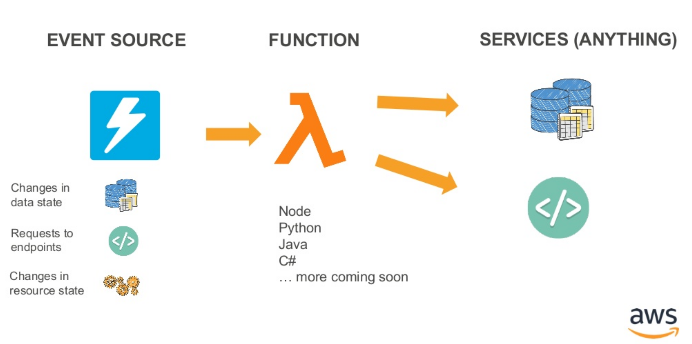

.>>

### What is AWS Lambda

- function-as-a-service (FaaS)
- runs your Python, NodeJs, JVM, .NET or Go Code
- no need for clusters, servers or containers
- no need to think about scaling 
- don't pay for idle
- built-in fault tolerance (e.g. retries, DLQs)
- synchronous, asynchronous and stream based execution

---

**SmartCat(egorization)**

<div style="background:#ffffff; height:550px">

</div>


---

### Problems we encountered...

<div style="text-align:left;color:#516188">
...and how we solved them
</div>


---

## Issue
#### Deployments of lambda functions is quite complex

.>>

### How-to deploy a lambda function

- package (zip) your sources
- upload your sources to s3
- create a lambda function
    - and roles/policies
    - and event/triggering resources (e.g. SNS-Topics)
    - and event-subscriptions/triggers
    - _you might also need:_ Api-Gateway, step-functions, canary deployment, other resources ...

&rarr; **Don't do it yourself** and try reinventing the wheel 

.>>

#### Instead: 

Use something that already exists ...

<div class="stretch">
    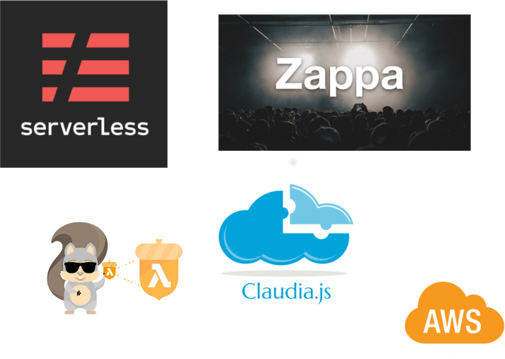
</div>

---

### Serverless Framework

<div style="height:450px">
    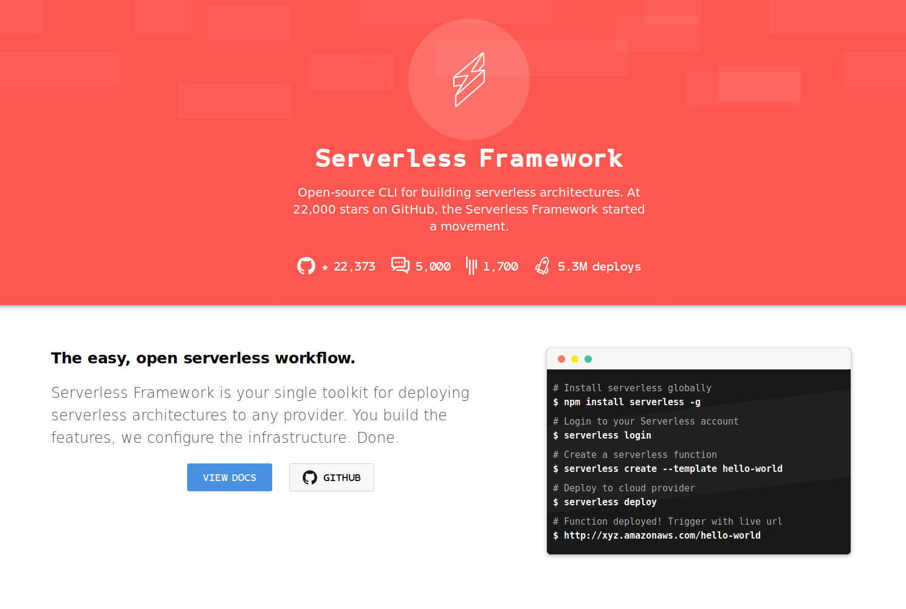
</div>
<div style="height:100px">
    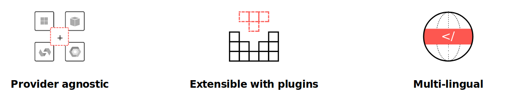
</div>

.>>

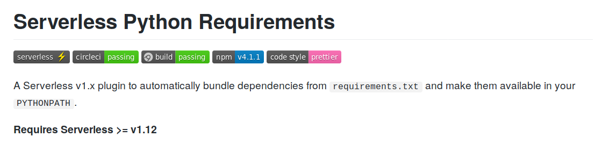

#### Perks

- cross-compilation (for binary dependecies)
- tons of configurable features

.>>

#### `serverless.yml`
```yaml
service: myService

provider:
  name: aws
  runtime: python3.6
  memorySize: 512
  timeout: 10 

custom:
  pythonRequirements:
    dockerizePip: true

functions:
  hello:
    handler: main.hello 
    name: ${self:provider.stage}-helloWorld 
    reservedConcurrency: 5 
```


---

## Issue
#### Large deployment-artifacts


.>>

<< Picture here of size of dependencies ... screenshot from `du` >>

- some libraries are large (e.g. Python ML-Libraries)
- &rarr; potentially too large for deployment:
    - hard limit of 250 MB for unzipped artifact
    - 50 MB (zipped) limit, when updating code for a single function


.>>

<div style="text-align:left; font-size:80%">
**Solution 1:** excluding tests & stripping libraries (`*.so`-files)<br>
&rarr; Example: Function with numpy, scipy and sklearn dependencies
</div>

```yaml
# serverless.yml
custom:
  pythonRequirements:
    slim: true
```

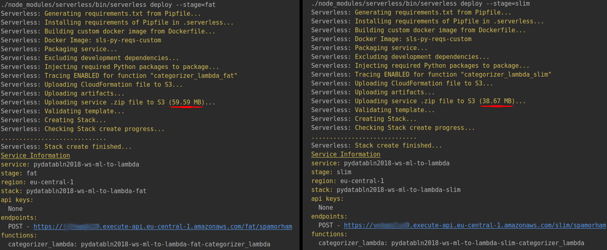

.>>

<div style="text-align:left; font-size:80%">
**Solution 2:** zip-in-zip and extract at runtime<br>
</div>

```yaml
custom:
  pythonRequirements:
    zip: true
```

```python
try:
  import unzip_requirements
except ImportError:
  pass
```


.>>

#### You might also try...

- load dependencies from s3
- customize your libraries (remove stuff you don't use)

---

## Issue

#### Long (cold) start-times

.>>

#### Influence of artifact size on cold-start times

<div class="stretch">
    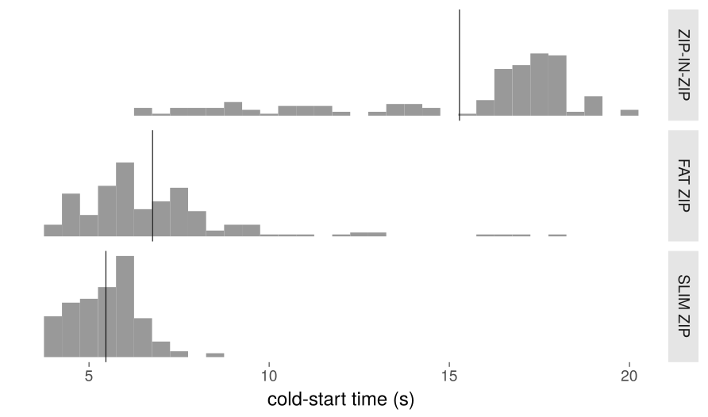
</div>
<small>as measured on lambdas with 256 MB of memory</small>

&rarr; cold-start times increase with size of artifact

.>>

#### Influence of language/memory on cold-start times

<div class="stretch">
    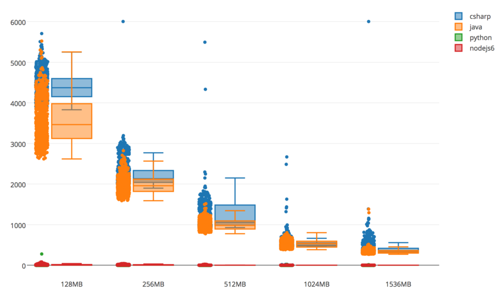
</div>
<small>
from: https://read.acloud.guru/does-coding-language-memory-or-package-size-affect-cold-starts-of-aws-lambda-a15e26d12c76
</small>

&rarr; cold-start times influenced by language of choice

.>>

#### VPCs and cold-start times


.>>

#### (Container)-Instance lifetime is longer than you think!

<div class="stretch">
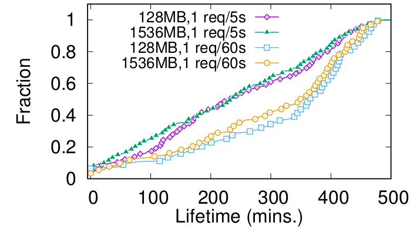
</div>
<small>
from: Peeking Behind the Curtains of Serverless Platforms.<br> https://www.usenix.org/conference/atc18/presentation/wang-liang
</small>

<div style="font-size:80%">
    &rarr; median instance lifetime 6.2 hrs; maximum idle time just 27 mins!
    &rarr; reuse connections; limit any I/O to initialization during cold-starts for blazingly fast warm-starts
</div>

.>>

#### Solution (1/2)
 
 
<div style="text-align: left;color:#516188">
<small>... for faster cold-starts</small>
</div>

- use another runtime
- make smaller artifacts 
    - strip away everything unnecessary
    - avoid clutter: use one artifact per function
- more memory (hence CPU) for Lambda
- avoid Lambdas in VPCs   
- preemptive Lambda warm-ups

.>>

#### Solution (2/2) 

<div style="text-align: left;color:#516188">
<small>... for faster warm-starts</small>
</div>

- avoid unnecessary I/O & network-calls during container uptime 
    - keep connections open
- do repetitive operations only once (during cold-start)
    - calls to external APIs (e.g. auth-flows)
    - decryption of env-variables using KMS  
    - use singletons and global/module state when possible


---

### A word on concurrency

#### beware of your backend!

<div class="stretch">
  <div style="text-align: left; float: left; height:400px">
       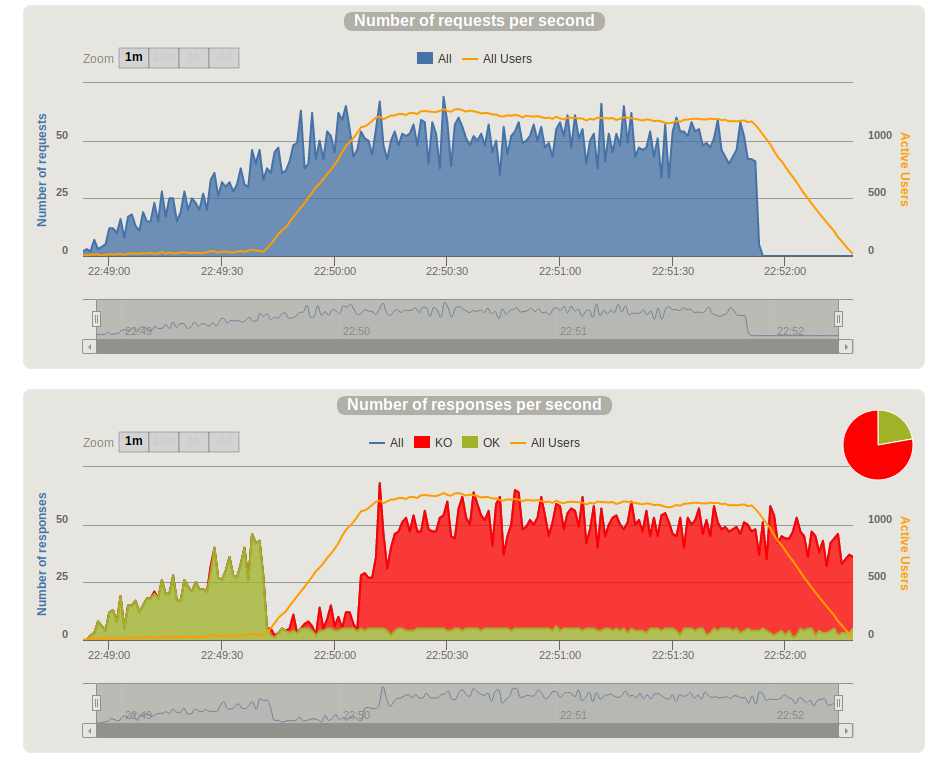
  </div>

  <div style="text-align: right; float: right; height:400px">
    <div style="height:220px">
    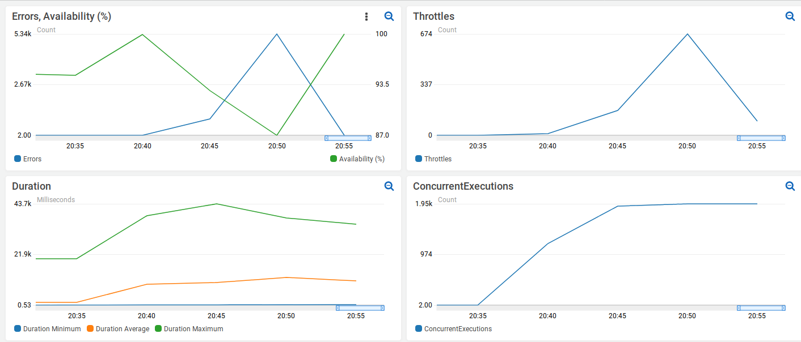
    </div>
    <div style="height:150px">
    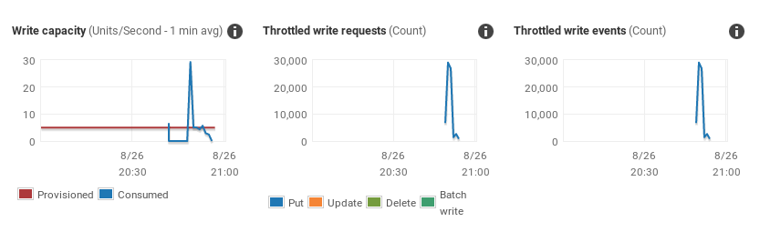
    </div>
  </div>
</div>

.>>

#### Lambda might scale endlessly
<div style="text-align:left;color:#516188">
(...other services may not)
</div>

&rarr; scale according to lambda concurrency setting, or lower concurrency 

- relational DBs &rarr; limit connections/sessions
- DynamoDB &rarr; increase read/write-throughput
- Aurora Serverless &rarr; increase Capacity Units
- REST-Endpoints &rarr; self-DDoS anyone?
    - beware of (multiple) self-invokation
    - also: mind the costs!

---

<div style="text-align:left">

<h2> Thank you </h2>

<b>Stay in touch</b>

<p>
[github.com/bweigel](https://www.github.com/bweigel)<br>
[linkedin.com/in/weigelb](https://www.linkedin.com/in/weigelb)<br>
[@dreigelb](https://twitter.com/dreigelb)
</p>

</div>

---

<div class="stretch">

</div>

.>>


<div class="stretch">

</div>

.>>

<div class="stretch">

</div>

.>>

<div class="stretch">

</div>

.>>

<div class="stretch">

</div>

.>>

<div class="stretch">

</div>

.>>

<div class="stretch">
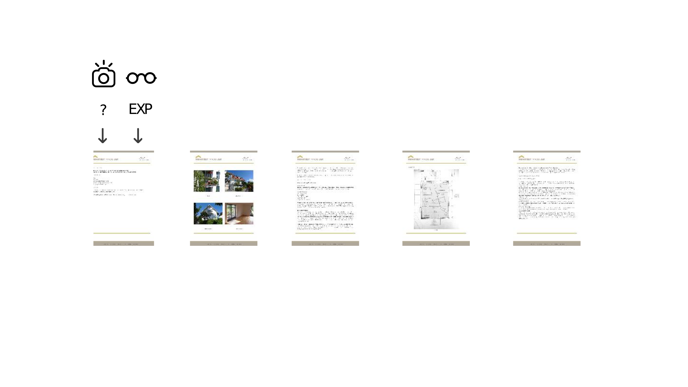
</div>

.>>

<div class="stretch">
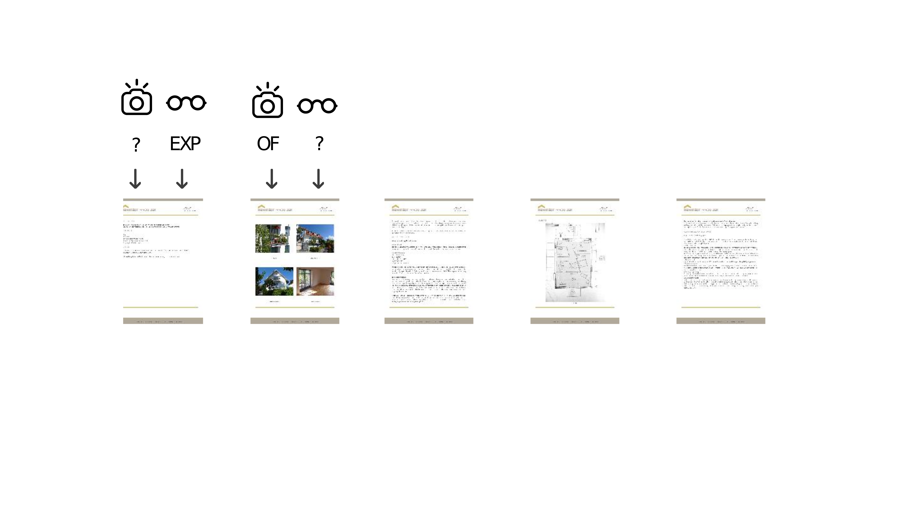
</div>

.>>

<div class="stretch">
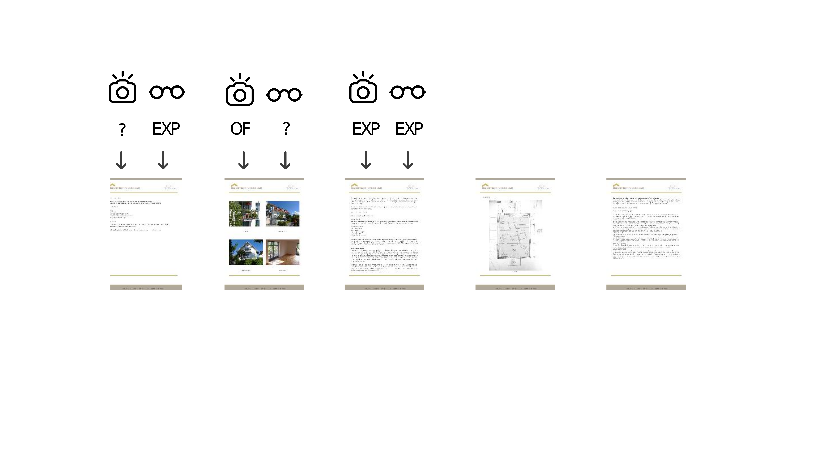
</div>

.>>

<div class="stretch">
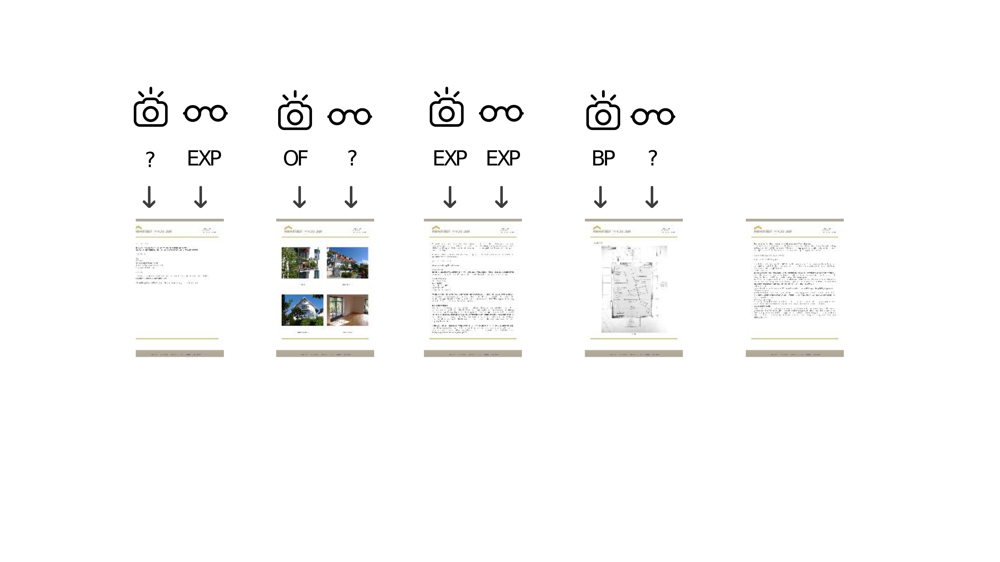
</div>

.>>

<div class="stretch">
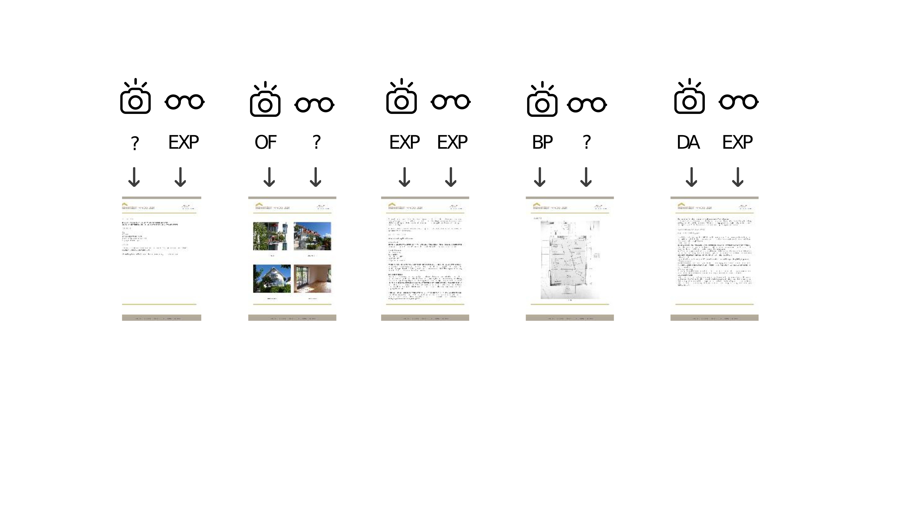
</div>

.>>

<div class="stretch">
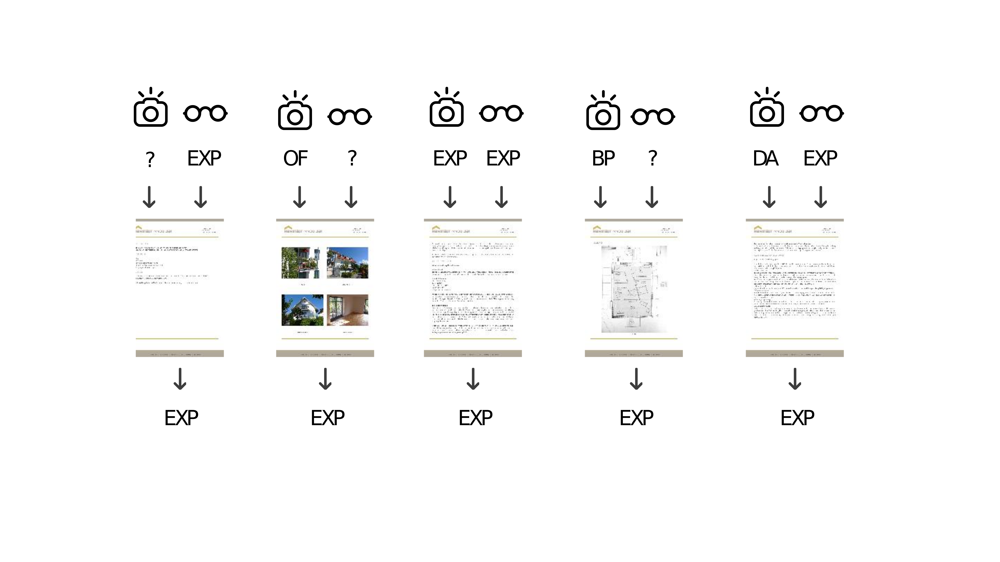
</div>
