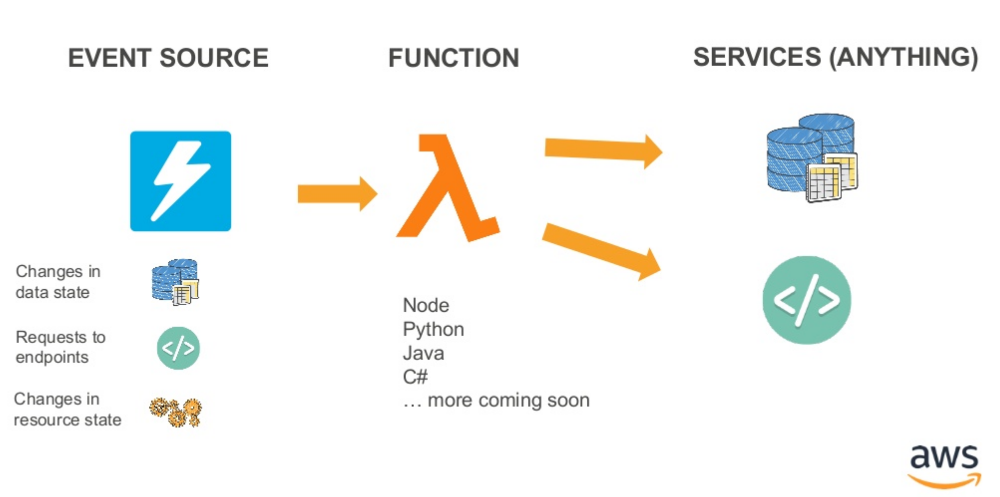
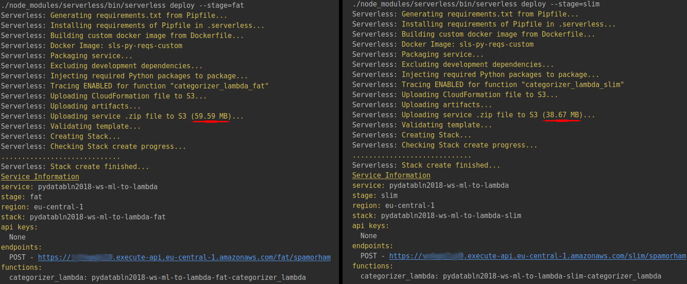

# Smart Cat(egorization)

<h4 style="color:#888888">Building a serverless multi-class document classification service using AWS Lambda</h4>

<div style="text-align:right">
<small>Benjamin Weigel</small>
</div>
<div style="text-align:right;color:#888888">
<small>
AWS Usergroup Meetup - 29.08.2018
</small>
</div>

---

## Who am I?

- biochemist
- Data Engineer in dNa-Team at Europace AG for the last 2 years
- experiences in serverless architectures:
    - etl-pipelines
    - reporting-services
    - serverless machine-learning services

.>>

<iframe width="1280px" height="720px" data-src="https://www.europace.de/"></iframe>

---

## Our business


.>>

#### The house of your dreams ...


.>>

#### Knowing you can afford it ...


---

## Our usecase


.>>

#### Getting some paperwork ...


.>>

#### Manually ordering tons of paperwork ...


---

#### How to start a machine learning project

<div>
<span class="image"  style="padding-top: 0px; padding-bottom: 0px">

</span> 
<div  style="padding-top: 0px; padding-bottom: 0px">&darr;</div><p>
<span class="image">

</span>

</div>


.>>

#### Ok. We have this model:


#### But, how to we put it into production?

.>>

#### serverless!

<div  style="height:600px; font-size:500%;  vertical-align: text-top" >

</div>

---

## (Optional) Intro to AWS Lambda ?! 



.>>

### What is AWS Lambda

- function-as-a-service (FaaS)
- runs your Python, NodeJs, JVM, .NET or Go Code
- no need for clusters, servers or containers
- no need to think about scaling 
- don't pay for idle
- built-in fault tolerance (e.g. dead letter queues)
- synchronous, asynchronous and stream based execution

---

**SmartCat(egorization)**

<div style="background:#ffffff; height:550px">

</div>


---

### Which problems we encountered...

<div style="text-align:left;color:#888888">
...and how we solved them
</div>


.>>

#### Why not use (cascading) S3-triggers?

- only one trigger per Bucket
- needed to include some metadata in the messages (page number, to know when we are done)


---

#### Large deployment-artifacts

<div id="left" style="font-size:80%">
**Problem**<br>
- ML-libraries are large<br>
&rarr; slow cold-start times<br>
&rarr; potentially too large for deployment
</div>


<div id="right" style="font-size:80%">
**Solution**
<br>
- excluding tests & stripping libraries (`*.so`-files)
</div>

.>>

<div style="text-align:left; font-size:80%">
**Example:**<br>Lambda function with numpy, scipy and sklearn dependencies
</div>

```yaml
custom:
  pythonRequirements:
    slim: true
```



.>>

### You might also try...

- zip-inside-zip (zip libraries inside deployment-zip & extract at runtime)
- load dependencies from s3
- customize your libraries (remove stuff you don't use)

---

#### Long cold start-times


---

## Serverless Framework


.>>

### Why the serverless framework?

- manages packaging & deployment of code    
- easy to use abstraction over cloudformation
    - &rarr; provisioning of infrastructure
    - uses cloudformation behind the scenes
- infrastructure as code &rarr; no click orgies
- maturity &rarr; great community & tooling via plugins
    


---

## Let's get to it then ...

---

<div style="text-align:left">

<h2> Thank you </h2>

<b>Stay in touch</b>

<p>
[www.github.com/bweigel](https://www.github.com/bweigel)<br>
[www.linkedin.com/in/weigelb](https://www.linkedin.com/in/weigelb)
</p>

</div>