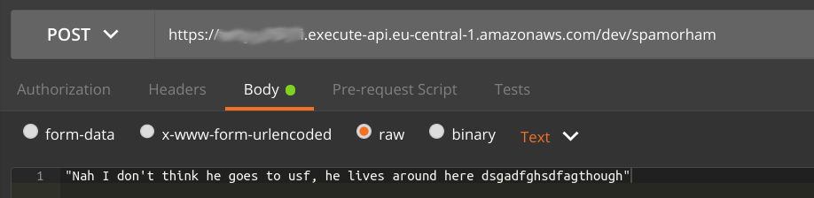
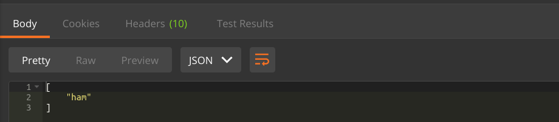

<div style="text-align:justify">
    At the end of this post we will have deployed a serverless machine learning service using AWS Lambda. We will have access to this service through an endpoint that talks to our lambda via AWS Api Gateway's proxy integration.
   

</div><br>

## What you will need to work along

- AWS account with programmatic access (*Access-Key-Id* and *Secret-Access-Key*)
- Python 3.6 (preferably through an [Anaconda](https://www.anaconda.com/download/) installation) 
- AWS commandline interface (`pip install aws-cli`)
- NodeJS (>=v8.0.0) and npm installed 

## Why do I need a service for my model?

<div style="text-align:justify">
What is the purpose of a machine learning model? To predict something. We have a set of observations (e.g. the words in an email) and want to predict a poperty about the observations (e.g. is the email spam or ham?). However nobody wants to spin up a jupyter notebook everytime they need some emails classified. So the first step into reusing a model might be to create a script that you can run from the command-line. But what if somebody else wants to use your great model? You would not want to spread around your script file. Instead you will want to create some kind of prediction service around your model, such that users may interact with this prediction service. 
    
This service should be publicly available such that anyone can take advantage of your model.  
</div>

## AWS Lambda & AWS ApiGateway 

[**AWS Lambda**](https://docs.aws.amazon.com/lambda/latest/dg/welcome.html) is basically a place in the cloud where your _python_, _jvm_, _.Net_,  _node.js_ code (or _golang_ binaries) can run. You don't need servers, just your code and you are ready to go. We will use AWS Lambda to run our prediction service.

[**AWS ApiGateway**](https://docs.aws.amazon.com/apigateway/latest/developerguide/welcome.html) enables you to create and publish RESTful APIs. It is the part that connects the users of your service (_public_) to your service (_private_). We will use it to do just that.

### Setting up AWS
1. S3 bucket
2. policies

# PART I:
## The machine learning model 

We will be using a naive bayes classifier trained on the [SMS Spam](https://www.kaggle.com/uciml/sms-spam-collection-dataset/version/1) Dataset, as described [here](https://www.kaggle.com/mzsrtgzr2/naive-bayes-classifier-spam-ham). I slightly modified the code and used a Jupyter Notebook for this part. If you downloaded the repo you will have access to this notebook.

### Building preprocessing and Naive Bayes model

Before every model training there is always preprocessing, since sklearn needs vectors to work. To obtain a vector that represent our message texts, we will use the TF-IDF-Vectorizer. The TF-IDF-Vectorizer itself is a model that needs to be fitted (`vectorizer.fit(data_train)`; the input here are the texts). 
It is **crucial** that your preprocessing is the same for your training and test data as well as the data that your service recieves later on. This is why we must persist the fitted TF-IDF-vectorizer.  

```python
import pandas as pd
from sklearn.model_selection import train_test_split
from sklearn.feature_extraction.text import TfidfVectorizer
from sklearn.naive_bayes import GaussianNB
from sklearn.metrics import accuracy_score
from sklearn.externals import joblib

df = pd.read_csv('./Data/spam.csv', encoding='latin-1')

# split data into test & training
data_train, data_test, labels_train, labels_test = train_test_split(
    df.v2,
    df.v1, 
    test_size=0.1, 
    random_state=42)
    
# TF-IDF     
vectorizer = TfidfVectorizer(sublinear_tf=True, max_df=0.5)
vectorizer.fit(data_train)
# save fitted vectorizer
joblib.dump(vectorizer, './models/tfidf_vectorizer.pkl')
```

After obtaining our vectors we can train the Naive-Bayes classifer and serialize it to disk:
```python
# use vectorizer to transform input-text to vectors
data_train_transformed = vectorizer.transform(data_train).toarray()

# gaussian naive bayes classifier
clf = GaussianNB()
clf.fit(data_train_transformed, labels_train)
# save naive bayes model    
joblib.dump(clf, './models/naive_bayes_clf.pkl') 
```

You can check the accuracy of the trained naive bayes classifier using the testdata. However, you might find an accuracy of around 90% is rather poor. 

```python
data_test_transformed  = vectorizer.transform(data_test).toarray()  
predictions = clf.predict(data_test_transformed)

print (accuracy_score(labels_test, predictions))
> 0.9032258064516129
```

You should now have two files (`tfidf_vectorizer.pkl` and `naive_bayes_clf.pkl`) that correspond to the preproccessor and prediction models, respectively. To see, if they still work together you can try loading the models from disk and predicting some result:

```python
import numpy as np

service_vectorizer = joblib.load('./models/tfidf_vectorizer.pkl')
service_classifier = joblib.load('./models/naive_bayes_clf.pkl')    

_texts = ["you know it is urgent and free"]
text_array = np.array(_texts)

vec = service_vectorizer.transform(text_array).toarray()
service_classifier.predict(vec)
> array(['spam'], dtype='<U4')
```

### Deploying serialized preprocessor & classifier

Now that we have serialized our preprocessing and classifier we need to put them somewhere the service (see below) can find them.
We will store our models in a private S3 bucket. If you do not already have a bucket you need to create one:
`aws s3api create-bucket --acl private --bucket <your_bucket_name>`

To deploy your models type:
```bash
$ aws s3 cp --recursive models s3://<your_bucket_name>/models/
upload: models/naive_bayes_clf.pkl to s3://<your_bucket_name>/models/naive_bayes_clf.pkl
upload: models/tfidf_vectorizer.pkl to s3://<your_bucket_name>/models/tfidf_vectorizer.pkl
```
To check if it's all there type `aws s3 ls <your_bucket_name>/models/`. This lists the model files on S3. 

**TL;DR** This concludes the first part. In this part we have:
- trained a TF-IDF vectorizer
- trained a gaussian naive bayes classifier
- used `joblib.dump()` to persist both models to disk
- uploaded the models to our S3 bucket

# PART II

## Building & deploying the service

Now that we have a serialized model we need a service that takes this model and uses it to call the models `predict()`-method 
on our input data. Furthermore, we need a way to tell our service what the input data is.
We will use AWS Lambda to take care of the first part (calling `model.predict(X)` given some input `X`) and let AWS ApiGateway 
handle the passing of the input data, which our users will supply via a `POST`-method to our ApiGateway endpoint.
The body shall contain the payload that we want to classify as raw text.

The function code is shown below.

**main.py**:
```python
import ...

def get_model():
    ... 
    return vectorizer, classifier
        
MODEL = get_model()

def predict(data):
    ...
    return prediction

def lambda_handler(event, context):
    data = event["body"]
    result = predict(data)
    return {
            "body": json.dumps(result),
            "statusCode": 200
            }
```

We will need three methods: 
 - the entry point of our lambda, `lambda_handler(event, context)`
 - one method to retrieve our model from S3, `get_model()`
 - and one method to carry out the prediction, `predict(data)`

When we call the API via ApiGateway, AWS will do its magic and pass our client request into our entrypoint, the `lambda_handler`.
The `event` object will contain the request, which will look something like this:

```json
{
  "body": "Am I spam or am I ham?",
  
  "resource": "/spamorham",
  "requestContext": {
    "resourceId": "123456",
    "apiId": "1234567890",
    "resourcePath": "/spamorham",
    "httpMethod": "POST",
    "requestId": "c6af9ac6-7b61-11e6-9a41-93e8deadbeef",
    "accountId": "123456789012",
    "identity": {
      ...
    },
    "stage": "prod"
  },
  "queryStringParameters": {
    "foo": "bar"
  },
  "headers": ...,
  "pathParameters": ...,
  "httpMethod": "POST",
  "stageVariables": ...,
  "path": "/spamorham"
}
```
There is a lot of information here about the request context, headers, querystring parameters etc.
However, we are only interested in the `body`, which contains the payload to be classified (i.e. "Am I spam or am I ham?")

To predict something from that payload, we need our model which is curently stored in S3 (see [above](https://github.com/bweigel/bweigel.github.io/blob/master/deploying_a_ml_service_to_aws_lambda.md#deploying-serialized-preprocessor--classifier)).

#### Fetching the model from S3

Retrieving the model (vectorizer & classifier) from S3 is fairly straight forward using the [boto3] api.
We load the model into memory using a `BytesIO()`-fileobject, which is subsequently deserialized using `joblib.load(...)`.
This way we avoid IO (writing to disk and loading from disk again), because:
> The fastest I/O is no I/O. <br>&emsp;- *Nils-Peter Nelson*

```python
def get_model():
    model_bucket = "mybucket"
    s3 = boto3.resource("s3").Bucket(model_bucket)
    
    with BytesIO() as vec:
        s3.download_fileobj(Key="models/tfidf_vectorizer.pkl", Fileobj=vec)
        vectorizer = joblib.load(vec)

    with BytesIO() as clas:
        s3.download_fileobj(Key="models/naive_bayes_clf.pkl", Fileobj=clas)
        classifier = joblib.load(clas)

    return vectorizer, classifier
```

The method returns a tuple, which contains the vectorizer as the first element and the classifier as the second.

Notice above, we retrieve the model during module initialization and assign it to the global variable `MODEL`.
We do this to optimize performance (see https://docs.aws.amazon.com/lambda/latest/dg/best-practices.html). 
Globally defined variables are only initialized once during the startup of the container instance and thus we only have to retrieve the model from S3 once
and can serve subsequent requests much quicker.

Now that we have our model and the payload, we are ready to predict.

#### Predicting a result

We cannot predict a result from a mere string. Our TF-IDF vectorizer expects an array to do its magic.
See below for how it's done.

```python
def predict(data):
    if isinstance(data, str):
        data = [data]
    
    text_array = np.array(data)
    vector = MODEL[0].transform(text_array).toarray()
    prediction = MODEL[1].predict(vector)
    return prediction.tolist()
```

We convert our string to an element of an array. This is done by wrapping the string in a list
and converting this to a numpy array `text_array`.
A prediction is executed by transforming the `text_array` into a vector using our TF-IDF vectorizer

```python
vector = MODEL[0].transform(text_array).toarray()
```
We can use this vector with our naive bayes classifier to predict if our text was ham or mere spam.

```python
prediction = MODEL[1].predict(vector)
```

Lastly we return a list containing our result.
 
### Unsing the result to create a valid proxy response

Last but not least we need to return something from our lambda code. For the ApiGateway to understand
what we return it must obey a specific [format](https://docs.aws.amazon.com/apigateway/latest/developerguide/set-up-lambda-proxy-integrations.html),
otherwise ApiGateway will respond with a `502 Bad Gateway` to the client. 

Here, our lambda returns the following

```json
{
"body": json.dumps(result),
"statusCode": 200
}
```

telling the client we have an `200 OK` statuscode and returning the stringified result.

Now there is nothing left, but test our new API:





Cool. Everything works as expected. I hope this was helpful.

[boto3]: https://boto3.readthedocs.io/en/latest/index.html