## Know-How Transfer 

<small>Benjamin Weigel, 22.09.2017</small>

<small>Alle Talks unter https://www.youtube.com/playlist?list=PLDX4T_cnKjD0JeULl1X6iTn7VIkDeYX_X</small>

---

### Was ist Flink? 

**Streaming Plattform** <!-- .element: class="fragment" data-fragment-index="1" -->
- Datensets:  <!-- .element: class="fragment" data-fragment-index="2"-->
  - unendliche (unbounded)
  - endliche (bounded)
- Execution Models: <!-- .element: class="fragment" data-fragment-index="3"-->
  - kontinuierlich (streaming)
  - diskontinuierlich (batch) 

.>>

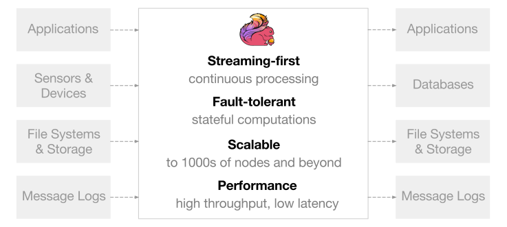

.>>

**exactly-once semantics for stateful computations**
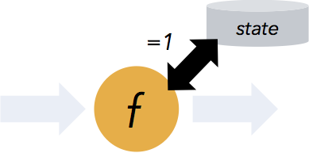

.>>

**event time semantics**
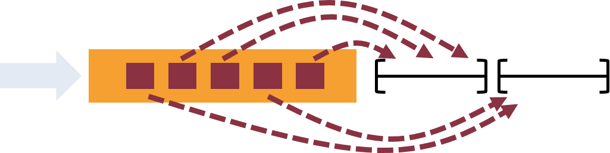

.>>

**flexible windowing**
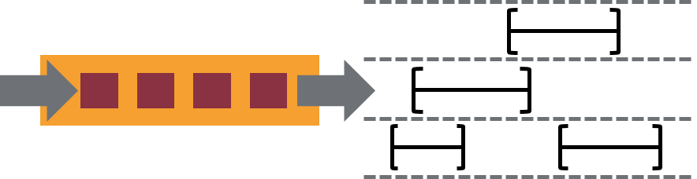

.>>

**parallelization and cluster computing**
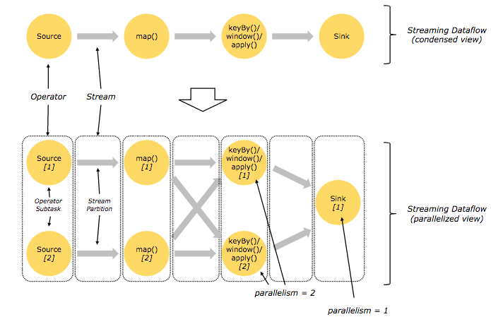

.>>

**fault-tolerance**
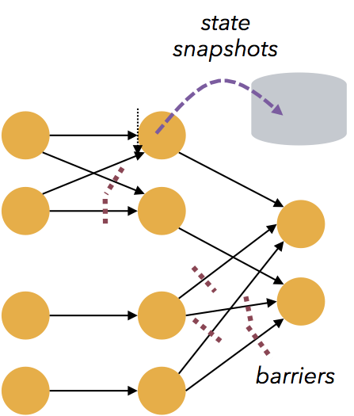

---

# Demo

---

## Who uses Flink?

- Alibaba (100B events/day, PB/day)
- Netflix (1.3B events/day, 13 PB/day)
- ING
- ...

---

### Connecting Apache Flink and the Pravega Stream Store

<small> Flavio Junqueira & Stephan Ewen</small>

<small>https://www.youtube.com/watch?v=cMrTRJjwWys</small>

.>>

### Pravega

- exactly once semantics
- transaction support
- auto-scaling
- unlimited retention
- efficient storage
- durability

.>>

### Pravega - How it works

- storage primitive: `stream`  
  - named, durable, append-only, infinite sequence of bytes
  - low-latency appends to / reads from the tail
  - high-throughput catch-up reads
  
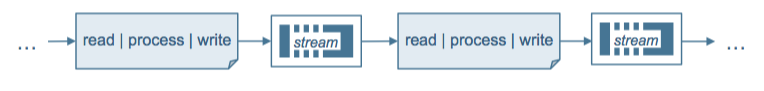

.>>

### Pravega - Scaling

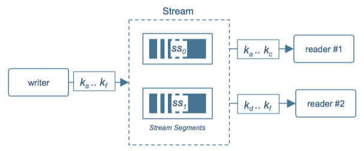
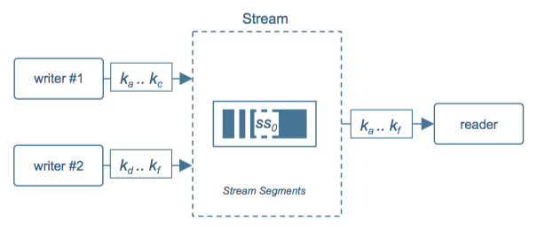

.>>

### Pravega - Scaling

- dynamic, coordinated & independent
- segmented internally
  - **writers unaware** of segment topology (just know about keys)
  - **readers learn** segment topology dynamically
  

.>>

### Pravega - Segmenting

---

### Drivetribe's Kappa Architecture With Apache Flink

<small>Aris Kyriakos Koliopoulos</small>

<small>https://www.youtube.com/watch?v=0cJ565r2FVI</small>

.>>

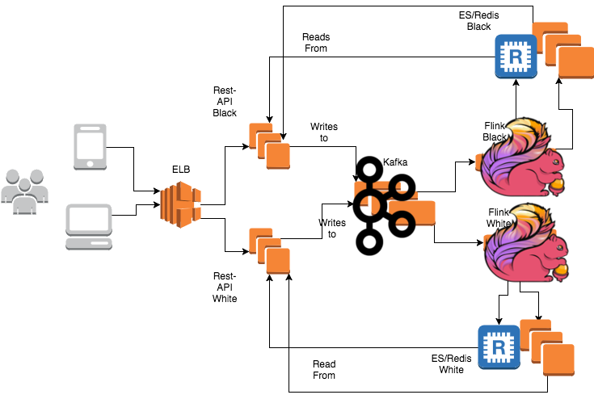

---

### From Streams to Tables and Back Again: A Demo of Flink's Table & SQL API

<small>Timo Walther</small>

<small>https://www.youtube.com/watch?v=j-idq54_kZM</small>

.>>

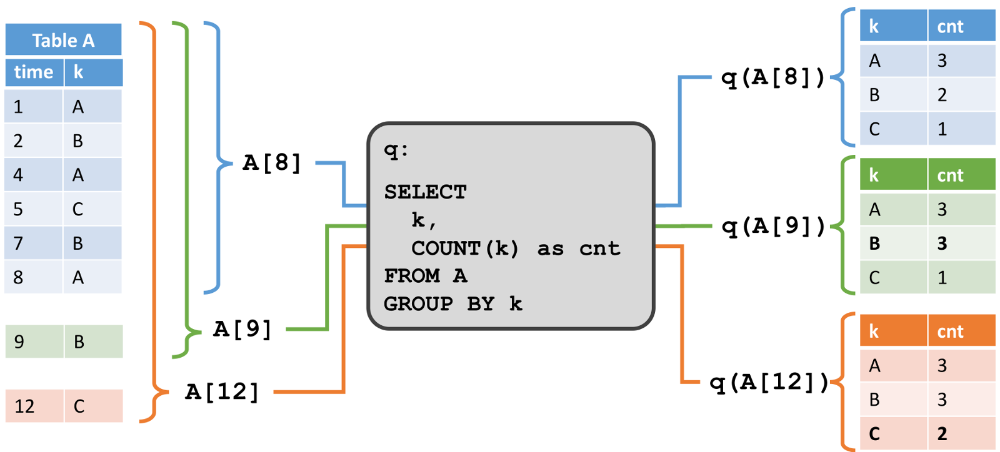

.>>

 <video data-autoplay loop>
    <source data-src="videos/flink_sql.webm" type="video/webm" style="align:top"/>
 </video>

---

### Build a Real-time Stream Processing Pipeline with Apache Flink on AWS

<small>  Steffen Hausmann </small>

<small>  https://www.youtube.com/watch?v=tmdEe3jpUX8 </small>

.>>

### AWS / Flink Demo

.>>

 <video data-autoplay loop>
    <source data-src="videos/flink_aws.webm" type="video/webm" style="align:top"/>
 </video>

