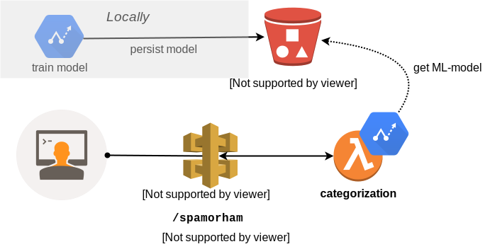

# Serverless ML-Models Workshop

<h4 style="color:#888888">Deploying ML-Models to the cloud using AWS lambda</h4>

<small>Benjamin Weigel</small>

<small>
PyData Berlin - 06.07.2018
</small>

---

## Who am I?

- biochemist
- Data Engineer at Europace AG for the last 2 years
**Interests:**
- serverless architecture, functional programming, scala, bayesian stats & methods

.>>

<iframe width="1280px" height="720px" data-src="https://www.europace.de/"></iframe>

---

## Serverless Evolution

.>>

### Serverless und ML

- once your model is finished you will want to use it: 
    - show your findings to the world
    - let the world use it 
    - raise productivity    

---

## AWS Lambda 

.>>

### What AWS Lambda can do for you

- function-as-a-service (FaaS)
- runs your Python, NodeJs, JVM, .NET or Go Code
- no need for clusters, servers or containers
- no need to think about scaling 
- don't pay for idle
- built-in fault tolerance (e.g. dead letter queues)
- synchronous, asynchronous and stream based execution

.>>

### AWS Lambda Pricing

**Free Tier (every user, every month)**
 - 1 million requests
 - 400 000 GBs of compute time
  

---

## AWS API Gateway

.>>

### What API Gateway can do for you

- managed throttling  and caching
- usage plans
- authorization / authentication
- DDoS protection
- Swagger support
- request/response data transformation and API mocking

.>>

### API Gateway Pricing

3.7$ per 1 Million API calls (1 Mio./month free in first year)

<section>
	<table>
        <tbody><tr>
            <td></td>
            <td></td>
        </tr></tbody>
    </table>
</section>

.>>

### Define an API

- create and API e.g. **MyCarAPI**
- define resources  
    - `/cars`
- define methoods for a resource `/cars/{carid}`
    - `GET`
    - `POST`
    - `DELETE`    

---

## Serverless Framework

.>>

### Why the serverless framework?

- manages packaging & deployment of code    
- easy to use abstraction over cloudformation
    - &rarr; provisioning of infrastructure
    - uses cloudformation behind the scenes
- infrastructure as code &rarr; no click orgies
- maturity &rarr; great community & tooling via plugins
    

---

## What we will build today

.>>

### Limitations of AWS Lambda & ML

- Memory & CPU Limit in AWS Lambda (3008 MB / 2? vCPUs)
- size of deployment package (max 250MB unzipped)

---

<h2> Thank you </h2>

<b>Stay in touch</b>

[www.github.com/bweigel](https://www.github.com/bweigel) 
[www.linkedin.com/in/weigelb](https://www.linkedin.com/in/weigelb)

